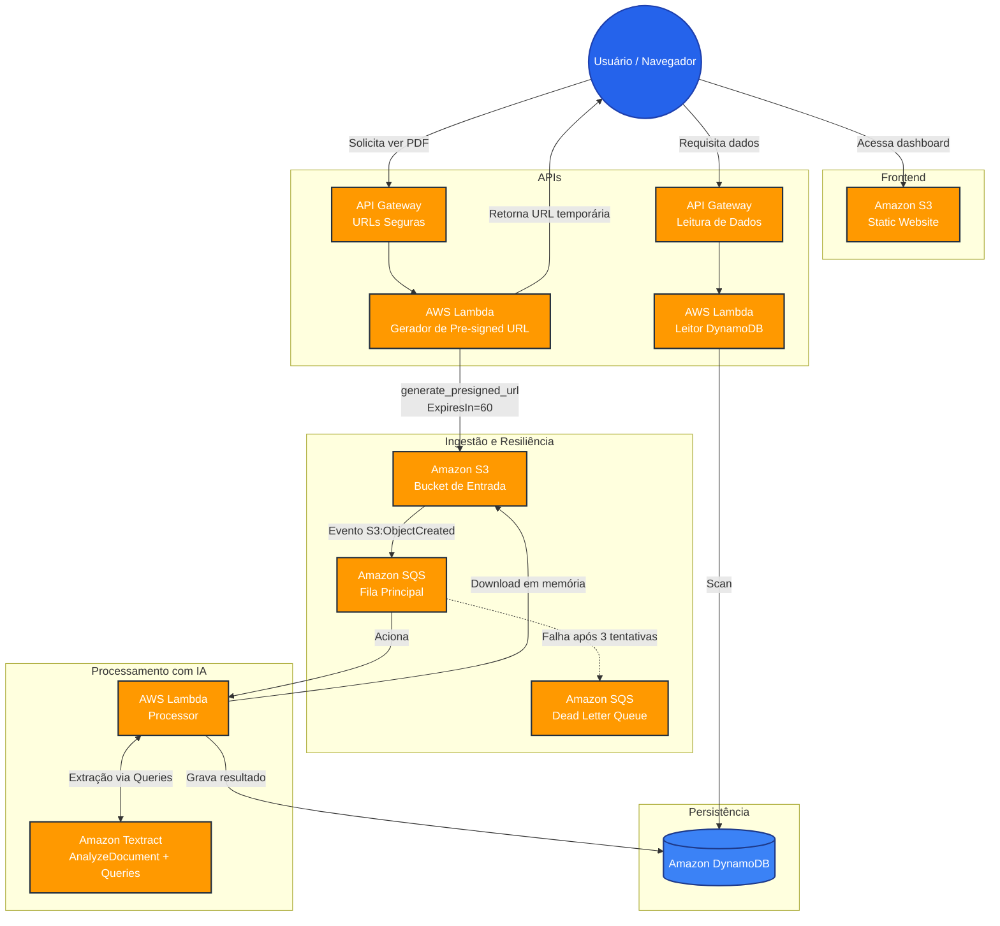

# 🧾 InvoiceIQ Pipeline Serverless de Extração Inteligente de Notas Fiscais


O **InvoiceIQ** é um pipeline serverless e orientado a eventos na AWS, construído para extrair automaticamente dados de notas fiscais e recibos (PDF/imagem, página única) usando o Amazon Textract, e disponibilizar esses dados através de um dashboard web simples.

Projeto pessoal de estudo prático de arquitetura distribuída, desacoplamento via filas, IA aplicada a documentos e infraestrutura como código não é uma solução pronta para produção em escala real.


*Fluxo completo: upload do documento, processamento assíncrono e visualização dos dados extraídos no dashboard.*

---

## 🚀 O que o sistema faz hoje (validado em produção de teste)

- **Ingestão assíncrona:** upload de documento no S3 dispara todo o pipeline via fila SQS, sem processamento síncrono no momento do upload.
- **Extração de dados via IA:** Amazon Textract (`AnalyzeDocument` com *Queries*) extrai fornecedor e valor total, respondendo perguntas em linguagem natural sobre o conteúdo do documento.
- **Resiliência a falhas:** mensagens que falham repetidamente (3 tentativas) são desviadas para uma Dead Letter Queue, evitando reprocessamento infinito comportamento testado com um incidente real de conta AWS bloqueada, não apenas simulado.
- **Dashboard web:** frontend estático hospedado em S3, consultando os dados via API Gateway + Lambda.
- **Visualização segura do documento original:** URLs pré-assinadas do S3 geradas sob demanda, com expiração de 60 segundos testado e confirmado: link expirado retorna `Access Denied`.

---

## 📊 Arquitetura do sistema




*Visão geral dos componentes AWS e de como eles se conectam no pipeline.*

---

## 🛠️ Tecnologias

- **Cloud:** AWS (S3, SQS, Lambda, DynamoDB, API Gateway, IAM, CloudWatch)
- **IaC:** Terraform
- **Backend:** Python 3.12 + Boto3
- **IA:** Amazon Textract  API `AnalyzeDocument` com *Queries* (perguntas em linguagem natural sobre o documento)
- **Frontend:** HTML/CSS/JavaScript puro, consumindo API via `fetch`

---

## 📈 Observabilidade e Monitoramento

Todo o pipeline é acompanhado via CloudWatch, com atenção especial ao comportamento da fila e da Dead Letter Queue em caso de falha de processamento.


*Visualização da Dead Letter Queue em ação, garantindo que falhas de processamento não causem perda de dados nem reprocessamento infinito.*


*Análise de latência e taxa de erro em tempo real, permitindo a identificação imediata de gargalos no pipeline de processamento.*

---

## 🧠 Decisões de arquitetura e desafios reais resolvidos

- **Migração de `AnalyzeExpense` para `AnalyzeDocument` + Queries:** a API de análise financeira padrão do Textract, otimizada para recibos americanos, não localizava corretamente o campo de fornecedor em notas fiscais brasileiras (retornava o título do documento ou `N/A`). A solução foi migrar para a API de análise de documento com *Queries*, fazendo perguntas diretas em linguagem natural (ex: "Qual o nome do Prestador de Servicos?").
- **Limitação não documentada da API de Queries:** o campo `Query.Text` do Textract rejeita caracteres acentuados, retornando `InvalidParameterException` comportamento confirmado por relatos da comunidade AWS, não descrito claramente na documentação oficial. A correção envolveu remover acentuação das perguntas enviadas à API.
- **Recuperação de Infrastructure Drift:** uma correção emergencial de código foi aplicada diretamente via `aws lambda update-function-code` (CLI) para desbloquear o pipeline rapidamente. Isso gerou divergência entre o estado real da infraestrutura e o Terraform. A reconciliação foi feita através de `terraform plan`/`apply`, garantindo que o código-fonte local voltasse a ser a fonte da verdade.
- **Resiliência validada com incidente real:** um bloqueio temporário de conta AWS (verificação de billing) causou falhas reais de processamento, permitindo validar o comportamento da fila principal e da DLQ em condição real de falha não apenas em teste planejado.
- **URLs de acesso seguro ao documento original:** implementadas via Lambda dedicada que gera *pre-signed URLs* do S3 com expiração curta (60 segundos), evitando expor o bucket publicamente.

---

## 📄 Exemplos de documentos de teste

A pasta [`terraform/assets`](terraform/assets) inclui algumas notas fiscais e recibos fictícios usados para validar o pipeline com layouts diferentes (recibo simples, NFS-e com retenções, cobrança em dólar, etc.):


- [`nota_fiscal_teste_03.pdf`](terraform/assets/nota_fiscal_teste_03.pdf)
- [`nota_fiscal_teste_05.pdf`](terraform/assets/nota_fiscal_teste_05.pdf)
- [`nota_fiscal_teste_07.pdf`](terraform/assets/nota_fiscal_teste_07.pdf)

---

## ⚠️ Limitações conhecidas

- **Precisão de extração do campo "fornecedor" ainda inconsistente:** em documentos com cabeçalho institucional em destaque (ex: nome de prefeitura em NFS-e municipal), o Textract por vezes captura o cabeçalho em vez do campo "Prestador de Serviços" correto. O sistema já implementa fallback (`"Fornecedor Nao Encontrado"`) para casos de baixa confiança, mas a extração ainda não é 100% confiável nesse cenário  é uma limitação conhecida e documentada, não um bug silencioso.
- **Escopo de documento:** processamento limitado a documentos de página única (API síncrona do Textract). Documentos multi-página exigiriam a API assíncrona (SNS + polling), fora do escopo atual.
- **Testes automatizados e CI/CD:** ainda não implementados próximo passo planejado (pytest + moto para testes unitários, GitHub Actions para `terraform plan` e testes a cada push).

---

## ⚙️ Como executar

**Pré-requisitos:** Terraform instalado, AWS CLI configurado.

```bash
# 1. Clonar o repositório
git clone https://github.com/DarleiVN/invoiceiq.git
cd invoiceiq/terraform

# 2. Provisionar a infraestrutura
terraform init
terraform apply -auto-approve

# 3. As URLs do frontend, endpoints de API e nomes de bucket
#    serão exibidos como output no terminal.
```

Para testar o pipeline manualmente:
```bash
aws s3 cp ./exemplos/nota_fiscal_teste.pdf s3://<SEU-BUCKET-DE-ENTRADA>/
aws dynamodb scan --table-name invoiceiq-dados-extraidos --region us-east-1
```

> **Nota de segurança:** o projeto segue o princípio de privilégio mínimo (least privilege) nas roles IAM. Em um cenário de produção real, seria recomendável adicionar AWS WAF e throttling às APIs expostas.

---
